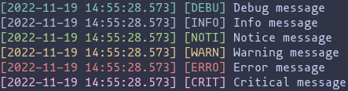

# gologs

Simple go logging package for consistent (and colored) logs.

## Preview

## Documentation

Run `godoc` in this directory and open the following link in your browser:
`http://localhost:6060`.